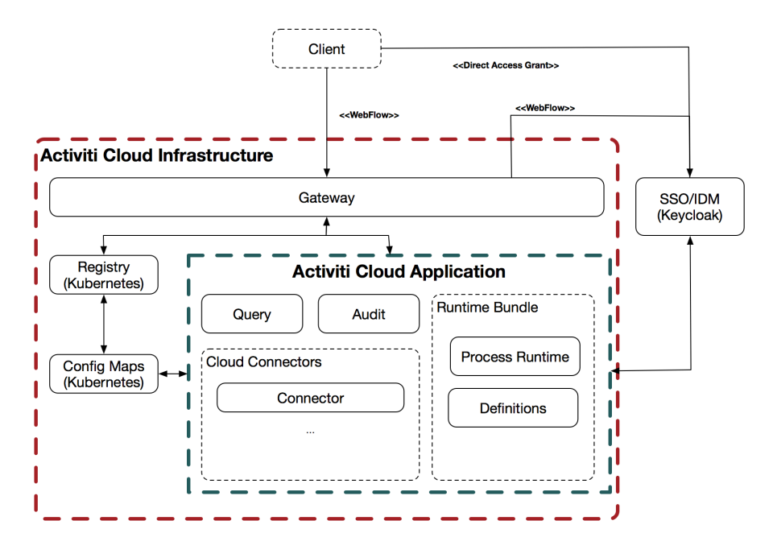
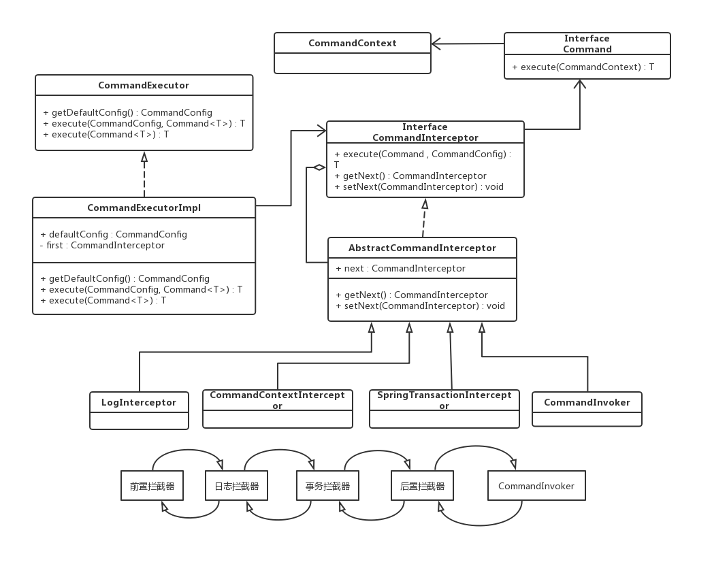

# Activiti Cloud
## 设计意图
- 旧版的痛点有哪些，怎么拆分剥离？？
- Activiti Cloud试图把流程引擎剥离为最小集，使他尽可能成为单一独立的模块，同时Activiti Cloud提供了一系列功能专一独立的服务，这些服务在大多数BPM实现中都需要，每个服务ready to be used,并且互相独立，用户可以选择使用或者不使用它，甚至替代成自定义的适合自己的需求
- 从Activiti Cloud的视角，Process Runtime的主要目标是理解BPMN2.x业务流程定义，并能够自动执行(runtime/process exection)，而不用关心
	- 流程定义存在哪
	- 处理流程定义版本控制
	- 用户管理
	- 单点登录
	- 作业执行
	- 定时器机制
	- 系统与系统的整合
	- 发邮件
	- 历史，审计信息，以及提供方式查询信息
	- 消费引擎数据的客户端的性能
	- 系统状态改变时通知其他系统
但是这些Process Runtime的功能，在我们去实现一个BPM工程时，90%可能需要用到
## 12-factors
---
## 组织架构
Activiti Cloud的目标首重是开发者和DevOps，他们负责搭建基础设施，确保Activiti App被平稳部署到云供应商
- 开发者
	- 负责构建系统与系统的Connectors,Connectors是内外部系统的整合点。流程引擎不需要知道这些Connectors, 整合是通过events。在运行时可以动态发现Cloud Connectors，他们将使用系统的故障转移(fail over)和反馈机制;
	- 也负责测试这些Connectors,并通过Maven/Docker打包，发布他们。
	- 也负责测试流程定义,及其依赖的Connectors
	- 测试完毕之后，负责发布Runtime Bundle和Connectors
- DevOps
	- 启动K8s Cluster, 部署基础设施
	- DevOps接受到发布的Runtime Bundles以及Cloud Connectors，并部署到基础设施上
## 架构


- 使用Kubernetes作为部署设施，使用Spring Cloud/Spring Boot开发微服务组件，使用Docker容器化发布组件
### Activiti7 Framework
使用下面技术，使得组件可以很好的与其他Infrestructure整合;
- `Spring Boot HATEOAS` :　确保所有的REST endpoints对齐，使用最少的代码维护
- `Spring Boot`: 创建REST endpoints, 依赖注入启动服务
- `Spring Boot Starter`: 使用@EnableAutoConfiguration在运行时创建所有的Bean
- `Spring Cloud Stream` : 保证我们能以异步的方式消费和发布事件，使得组件间独立，不会紧耦合。Binder可以使得组件可以使用不同的Message Brokers，比如Kafka, RabbitMq,Amazon SQS;
- `Spring Cloud Kubernetes` : 服务注册，发现，路由...,我们用的Eurakel...
### Infrastructure
Activti Cloud被设计运行在k8s上，所以Activiti Cloud会使用K8s的原生服务，比如K8s服务注册，Config Maps, secrets, Jobs/CronJobs等等
- `Gateway :` 提供访问所有服务的单一入口，服务注册，发现，与路由..
- `SSO`
- ``
- `Activiti Cloud Applications Service` : 新增的
### Components in Cloud Application
核心组件：
- `Runtime Bundle`: **流程引擎的云版本**　提供业务流程，任务，决策表/决策树的执行
	- Runtime Bundle是一个流程引擎无状态实例，负责执行一个不可变得流程定义集合
	- 不能部署新的流程定义到Runtime Bundle, 如果想更新流程定义，需要创建一个新版本的Runtime Bundle,
	- Runtime Bundle提供同步REST,异步消息于外部
	- 监听内部流程引擎事件，把处于同一个事务里面的事件转为消息，使用内部`ActivitiEventListener`接口实现，向外不发布事件
	- 默认执行Service Task 发布Integration Event实现系统与系统之间的交互。这些事件会被Connectors订阅
- `Cloud Connectors`: 与外部系统的双边链接
- `Audit Service`:　收集来自一个或多个Runtime Bundle的事件
- `Query Service`:　提供对一个或多个Runtime的读访问
- `Notification Service`:

## Runtime Bundle剖析与扩展
## Activiti设计模式：


- **命令与责任链模式**
- **观察者模式**
- **工厂模式**
- **代理模式**
## 事件转发机制
### 引擎内部
---
- **内部事件**--ActivitiEvent:
	- 事件类型，执行流Id, 流程定义Id, 流程实例Id
- **事件类型**--ActivitiEventType
	- 实体CRUD，任务创建/完成，活动，历史活动，变量，流程启动/完成/取消...
- **内部事件监听器**
	- 全局事件监听器`eventListeners` : List< ActivitiEventListener>
		- 实现上使用的**COW** : new CopyOnWiriteList();
	- 具体类型事件监听器集合`typedListeners` : Map集合--Map<ActivitiEventType --> List<ActivitiEventListener>>
		- 可以细化归类事件，比如只对变量相关的事件监听...
- **观察者模式**: ActivitiEventSupport实例就是目标对象，观察者对象ActivitiEventListener的添加和删除以及通知观察者的方法dispatchEvent;
- **引擎内部事件转发器**--ActivitiEventDispatcher:
	- 内部委托给ActivitiEventSupport，持有全局事件监听器集合，具体类型事件监听器集合，负责**注册，移除事件以及dispatch事件**
	- **怎么收集eventListeners** ? ProcessEngineConfigurationImpl在实例化时，会将实现了ActvitiEventListener的Bean组装成集合注入，initEventDispatcher时会获取它们并注册

### 引擎外部
---
下面以ACTIVITY_CANCELLED内部事件为例，解释事件传播到AuditService的过程
- 内部事件监听器持有ActivityCancelledListenerDelegate持有外部监听器ProcessRuntimeEventListener<BPMNActivityCancelled>集合processRuntimeEventListeners，可能多个**外部事件监听器**关注该事件，该场景下外部监听器实例是CloudActivityCancelledProducer类型
- CloudActivityCancelledProducer中持有ProcessEngineEventsAggregator，暂且叫**引擎事件聚合器**，它内部持有MessageProducerCommandContextCloseListener，而该监听器实现了**CommandContextCloseListener**，它实现了closed方法，并对收到的event会进行处理,该监听器内部持有Spring Cloud Stream的channel实例，channel实例会将转化后的事件扔给Message Broker,最后会被Audit Service订阅
- 内部事件监听器监听到内部事件调用onEvent,然后迭代将事件转交给外部监听器处理，外部监听器会将事件交给聚合器，我们知道Activiti中的任何过程都是由命令发起的，基于命令和责任链的设计模式，这里聚合器会将命令上文监听器添加到当前命令上文中去，当上下文关闭时，会将该命令过程中收集的该类型事件依次发布出去...

## 流程运转机制
---
- 流程模型解析成流程虚拟机对象，bpmnParse.execute()就是解析的入口;
### 元素解析
经元素解析后，流程文档中的元素最终解析成Activiti的内部表示BaseElement实例，流程模型转化为内存中BpmnModel对象
- BpmnXMLConverter类中的convertToBpmnModel方法所做的工作就是将流程文档中的元素解析并转化为Activiti中的内部表示;
- BpmnXMLConverter中持有**元素解析器xxxXMLCoverter**集合，即负责将xml格式元素转换为内存中元素对象;
### 对象解析
BpmnParse持有**对象解析器xxxParseHandler**集合，负责个元素对象的解析，流程虚拟机的属性注入在流程部署的过程中已经开始。
- BpmnParse中的applyParseHandlers负责全局调度对象解析工作，首先会委托给process元素对象的ProcessParseHandler.parse(bpmnParse, process)流程对象，这是流程对象解析的入口；
- 对象解析器集合的初始化，在PECImpl.initBpmnParser()初始化，BpmnParser持有BpmnParseFactory，有该工厂创建BpmnParse,并设置他的bpmnParseHandlers属性
- BpmnParseHandler的parse方法作为模板方法调度对象解析工作,process对象解析完毕后，解析结果添加到bpmnParse对象中的processDefinitions集合中，然后在此可以根据解析的元素，可能是你自定义的元素，向Activity对象中添加监听器，或者比如ServiceTask会根据不同的服务类型，为ServiceTask(他继承了Activity)添加不同的行为类ActivityBehavior

### 流程虚拟机运转
**从RuntimeService::startProcessInstanceByMessage(String messageName)谈流程的运转过程**
- 命令执行器**commandExecutor**执行命令StartProcessInstanceByMessageCmd(后面简称启动命令)
- 依据责任器模式，命令会先经过前置拦截器，日志拦截器，事务拦截器，上下文拦截器，后置拦截器处理之后，才调用命令，最后还有一个回溯的过程。
- 命令的**execute**:
	- **检查消息订阅**:根据消息名检查数据库中是否有该消息事件订阅，检查该消息是否是该流程定义的启动事件
	- **检查缓存是否需要重新部署**: 获取DeploymentManager（他管理了processDefinitionCache，该cache是ProcessDefinitionEntry集合，每个Entry持有processDefinition,bpmnModel,process对象）,查询缓存中是否存在ProcessDefinition，如果不存在，就委托ProcessDefinitionEntityManager实例查询数据库是否存在该processDefinitionId的流程定义，如果没有直接报错，否则重新部署加载到内存(resolveProcessDefintion),重新生成流程定义缓存数据。ProcessDefinitionEntityManager实从数据库中直接获取的ProcessDefintionEntity实例对象的属性仅仅是与ACT_RE_PROCDEF表中的字段值一一对应，，即ProcessDefintion对象，而流程虚拟机最终需要的的是元素解析阶段得到的bpmnModel,和对象解析得到的Process中的Activity对象，所以需要再次部署。解析完毕后，processDefintionCache也有了，流程实例助理类processInstanceHelper会调用createAndStartProcessInstanceByMessage创建流程实例
- **创建并初始化**：
	- **检查缓存**：流程定义工具类processDefinitionUtil从缓存中获取process对象, process.getFlowElements()获取所有流程定义中所有元素，找出所有StartEvent对象，且是消息启动类型，且名称相符(可能有多个，但只取第一个，另外如果是无指定开始事件，在process对象中会有initialFlowElement，直接获取就行),然后进入createAndStartProcessInstanceWithInitialFlowElement(...)
	- **创建实例**: 获取流程启动人，从当前命令上下文获取ExecutionEntityManager,创建ExecutionEntity实例(主执行流就是processInstance),为该对象插入数据库做准备，但是这里并没有对ExecutionEntity进行属性填充操作，内部是调用insert,只是通知引擎ExecutionEntity实例化操作已经执行完成，并且做好了插入会话缓存的准备。
	- **属性填充** : 并设置启动人,获取process下的dataObjects,设置为流程变量, 如果命令参数传入变量，也设置成流程变量,设置流程实例名
	- **发布事件** ：如果开启事件转发器，发送ENTITY_INITIALIZED事件
- **启动流程实例**:
注：**流程实例和执行实例的区别???**
如果流程实例不存在分支或者多实例节点，则流程实例和执行实例的id相同(看代码好像不是???)，两者的值分别对应ACT_PROC_EXECUTION表中的PROINST_ID_和ID_列；如果存在分支则不一样
- **创建子执行实例childExcutionEntity**: 创建过程中初始化，继承父执行实例(这里是processInstance)的部分属性,设置当前活动为initialFlowElement, 设置父子关系等等(但是未见到设置Id的地方),把该子执行实例添加到父执行实例的executions集合中
	```java
	 １．　parentExecutionEntity.addChildExecution(childExecution);
	 －－－
	 ２．　public List<ExecutionEntityImpl> getExecutions() {
        this.ensureExecutionsInitialized();
        return this.executions;
    }
	```
- **检查是否有子流程**：如果不包含，则获取子执行流的第一个，然后把它封装为ContinueProcessOperation，提交给流程虚拟机调度执行
	```java
	--- startProcessInstance
	1. ExecutionEntity execution = (ExecutionEntity)processInstance.getExecutions().get(0);
	2. commandContext.getAgenda().planContinueProcessOperation(execution);
	--- DefaultActivitiEngineAgenda [流程虚拟机]
	//保存所有需要执行的AbstractOperation，就是一个FIFO的queue,命令调度执行
	protected LinkedList<Runnable> operations = new LinkedList();

	3. public void planContinueProcessOperation(ExecutionEntity execution) {
        this.planOperation(new ContinueProcessOperation(this.commandContext, execution));
    }
	4.public void planOperation(Runnable operation) {
        this.operations.add(operation);　//
        if (operation instanceof AbstractOperation) {
            ExecutionEntity execution = ((AbstractOperation)operation).getExecution();
            if (execution != null) {
				//ContinueProcessOperation会被添加到involvedExecutions
                this.commandContext.addInvolvedExecution(execution);
            }
        }

        logger.debug("Operation {} added to agenda", operation.getClass());
    }
	```
- **发布流程实例启动事件**
---
> **但是把下一个要执行流添加到Agenda之后，什么时候会触发执行呢？？**
> 回到拦截器的最后一环**CommandInvoker**
- **命令调用者拦截器**:
```java
--- CommandInvoker
public <T> T execute(CommandConfig config, final Command<T> command) {
	final CommandContext commandContext = Context.getCommandContext();
	//向流程虚拟机中添加执行StartProcessInstanceByMessageCmd的任务只是runnable对象，并非AbstractOperation，所以与是与执行流无关的Operation(或者说与流程推进无关的Operation),
	commandContext.getAgenda().planOperation(new Runnable() {
		public void run() {
			commandContext.setResult(command.execute(commandContext));
		}
	});
	this.executeOperations(commandContext);
	if (commandContext.hasInvolvedExecutions()) {
		//???InclusiveGatewayActivityBehavior好像属于这一类
		Context.getAgenda().planExecuteInactiveBehaviorsOperation();
		this.executeOperations(commandContext);
	}

	return commandContext.getResult();
}
protected void executeOperations(CommandContext commandContext) {
    //执行命令执行过程中添加的所有的Operation
	while(!commandContext.getAgenda().isEmpty()) {
		Runnable runnable = commandContext.getAgenda().getNextOperation();
		this.executeOperation(runnable);
	}

}

public void executeOperation(Runnable runnable) {
	if (runnable instanceof AbstractOperation) {//执行和流程运转相关的Operation
		AbstractOperation operation = (AbstractOperation)runnable;
		if (operation.getExecution() == null || !operation.getExecution().isEnded()) {
			if (logger.isDebugEnabled()) {
				logger.debug("Executing operation {} ", operation.getClass());
			}

			runnable.run();
		}
	} else { //单纯执行命令的任务
		runnable.run();
	}

}
```
- **ContinueProcessOperation**的执行分析:继续执行下一个执行流execution
 	- 如果当前节点是**FlowNode(比如活动，或者网关)**:
	 	- **检查incomingFlows**, 如果没有，则执行流程启动执行监听器
		- **检查是否是子流程**: ...
	 	- **如果是常规活动，比如ServiceTask**, 并检查同步/异步，下面以同步为例
		- 如果活动是同步的，执行附加在活动上的start执行监听器-->获取该活动行为类,并执行为该活动类型设置的ActivityBehavior.execute(this.execution)，否则预添加TakeOutgoingSequenceFlowsOperation到流程虚拟机
		- 一般会设置活动行为，转**活动行为机制**...
 	- 如果当前节点是**SequenceFlow(连线)**:
		- 会分别执行和它关联的ExecutionListeners,比如start,take,end ,
		- 获取并设置targetFlowElement(下一个节点)
		- 替换execution的当前节点为tagetFlowElment, 可以看出执行流没变，也就是没有分支产生不会产生新的执行流，遇到网关或者开始节点会新建。
		- 然后继续提交新的ContinueProcessOperation，即流转到下一个节点

## 活动行为机制
在流程运转过程中，执行到活动节点会执行活动的行为，活动的行为需要考虑的情况: 当前任务是否满足条件，任务完成后流程可以途经的连线，最到达的目的地等，总而言之，封装了活动需要完成什么功能，然后最终走向。
- **什么时候为活动添加ActivityBehavior??**  在对象解析阶段，在活动对应的对象解析器xxxParseHandler里面设置活动的行为
- **怎么创建活动行为工厂ActivityBehaviorFactory??**,可以自定义活动行为工厂来替换默认的，它持有ExpressionManager,用于处理表达式
- **以MQServiceTaskBehavior为例看看execute的执行**
		- 首先获取ServiceTask中implementation属性配置的本地方法类名，然后去bean容器查，找到后检查是否实现了Connector接口,如果存在，就会执行该处理类，否则作为通过MQ发给第三方处理，同时通过Integration保存当前上下文，这里MQServiceBehavior,会等待外部返回消息，另有消息处理器ServiceTaskIntegrationResultEventHandler，恢复上下文，trigger流程继续运转；
```java
--- DefaultServiceTaskBehavior
public void execute(DelegateExecution execution) {
        Connector connector = (Connector)this.applicationContext.getBean(this.getServiceTaskImplementation(execution), Connector.class);
        IntegrationContext context = this.integrationContextBuilder.from(execution);
        connector.execute(context);
        execution.setVariables(context.getOutBoundVariables());
        this.leave(execution);
    }
private String getServiceTaskImplementation(DelegateExecution execution) {
     return ((ServiceTask)execution.getCurrentFlowElement()).getImplementation();
 }

 protected boolean hasConnectorBean(DelegateExecution execution) {
     String implementation = this.getServiceTaskImplementation(execution);
     return this.applicationContext.containsBean(implementation) && this.applicationContext.getBean(implementation) instanceof Connector;
}
--- MQServiceTaskBehavior extends DefaultServiceTaskBehavior
public void execute(DelegateExecution execution) {
     if (this.hasConnectorBean(execution)) {
         super.execute(execution);
     } else {
         IntegrationContextEntity integrationContext = this.storeIntegrationContext(execution);
         this.publishSpringEvent(execution, integrationContext);
     }

 }
 public void trigger(DelegateExecution execution, String signalEvent, Object signalData) {
 	//离开活动行为类，流程继续运转
	this.leave(execution);
}
```
- **最后都会离开活动行为类this.leave(execution)**,在没有多实例，或者补偿事件等特殊情况会执行TakeOutgoingSequenceFlowsOperation，处理离开工作。
```java
protected void performOutgoingBehavior(ExecutionEntity execution, boolean checkConditions, boolean throwExceptionIfExecutionStuck) {
	  Context.getAgenda().planTakeOutgoingSequenceFlowsOperation(execution, true);
  }
```
## 监听器机制
- **执行监听器**：执行时机活动的start与end, 连线的take
- **任务监听器**: 执行时机任务assignment,create,complete
- **监听器代理**: Activiti在触发用户配置的监听器中的notify方法之前，做一层全局功能架构，即使用代理模式对监听器的访问进行控制，这样设计的之后，就可以对监听器进行拦截，从而控制监听器是否可以执行。
## 谈谈对Activiti的自定义扩展...
---
### 扩展定时边界事件
使得时间到了，任务自动完成(Activiti中定时边界事件的使用，分两种，一种是事件到，interrupt附着的活动执行，另一种是non-interrupt，但是会从边界事件出边分支继续执行，这样就有两条并行的执行流,这两种都不符合我们的需求），我们只针对非中断的情况

- **“怎么自定义逻辑???找行为类”** 我们继承BoundaryTimerEventActivityBehavior并实现自定义的L2LBoundaryTimerEventActivityBehavior,在非中断的处理逻辑中，判断当前边界事件的的是否有outgoingFlows，如果没有，获取当前边界事件的父执行体parentExectionEntity,然后获取当前任务Id, 从引擎全局上下文Context获取全局配置ProcessEngineCongfiguration对象，进而获取命令执行器CommandExectutor执行已有的进而获取命令执行器CommandExectutor执行已有的CompleteTaskCmd
- **“怎么把自定义行为类添加到引擎，替换原来的？？？找行为工厂类”** 首先得替换引擎默认的行为工厂，覆盖父类的创建函数createBoundaryTimerEventActivityBehavior即可。

### 引入新的元素－－活动注解
 在活动上加注解Annotation,使得方便的在活动前后执行一些任务，比如给第三方发送异步事件，调用第三方服务执行指定的逻辑，等待返回结果触发流程运转，也可以不等待，继续运转，看注解配置（这里说法得改改）

 - AnnotationManager管理所有部署的流程定义的的Annotation，在流程定义自动部署完毕后，我们会使用AnnnotatinColletor进行收集，缓存在AnnotationManager中；
 - Annotation的收集靠AnnotationService,类似Activiti中本身就提供的核心引擎服务，比如RuntimeService, TaskService等，AnnotationService的API实现以向引擎发出命令的模式进行交互，提供命令比如：
	 - GetActivityAnnotationsCmd:获取某个活动上的Annotaiton
	 - GetAllActivitiesAnnotationsCmd:获取某个流程定义中所有活动上的Annotation
	 - ...
	 - 基本模式就是： Service API --> XXX CMD ---> Process Engine
 - AnnotationManager中的AnnotationBehavior对象，负责在流程运转时处理Annotation，即负责Annotation的功能实现，这里做的工作就是把当前Annotation封装成AnnotationIntegrationEvent交给第三方处理，也可以选在本地处理，看Annotation的具体配置；
 - 因为需要流程流转到节点时，检测当前的活动的Annotation，我们需要干预流程虚拟机，重写流程虚拟机中默认的ContinueProcessOperation,
	 - **"如何扩展流程虚拟机？"**-->继承默认的流程引擎配置类，覆盖父类中initAgendaFactory(), 替换默认的流程虚拟机工厂为自己定义的L2LActivitiEngineAgendaFactory,然后在覆盖其中的createAgenda方法，返回自定义的L2LActivitiEngineAgenda,即可以重写默认的planContinueProcessOperation方法，添加自定义的L2LContinueProcessOperation;
- L2LContinueProcessOperation继承于引擎本身的ContinueProcessOperation,只需覆写其中的run()方法，即可植入处理Annotaiton的逻辑，然后当检测到Annotation的时候，从引擎配置中获取AnnotationManager，交给AnnotationBehavior处理即可,ActivitiBehavior会保存当前上下文，最基本实现是，流程会没有检测到后续新的Operations,而暂停运转，直到第三方返回处理结果，根据返回结果中的流程实例Id, 活动Id信息，恢复之前的上下文，重新向流程虚拟机发送AnnotationTrigglerCmd，使之继续运转，完成后续任务。
### 你喜欢哪些书？
- OMG BPMN 2.x Spec
- Cloud Native Java
- Building Microservices
- Implementing Domain Driven Designs
- BPMN method and style
- 12 factor apps
- Beyond the 12 factor app
- Kubernetes in Action
