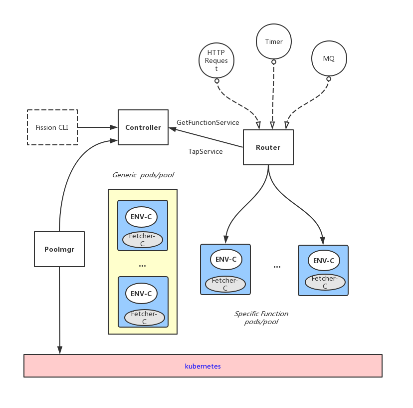
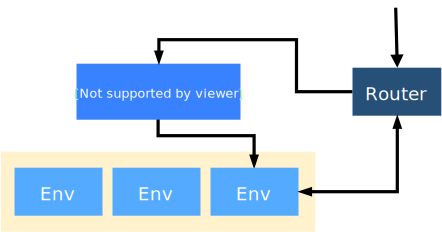
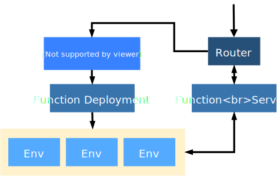

# Serverless报告
"Serverless architectures refer to applications that significantly depend on third-party services(AKA Backend as a Service or "BaaS") or on custom code that is run ephmemeral containers (Function as a Service or "FaaS")"
 - 官话：服务器架构是基于互联网的系统，应用开发不使用常规的服务进程，而是依赖于第三方服务，客户端逻辑和服务托管远程过程调用的组合
 - 白话：**Serverless就是应用不再需要考虑服务器的硬件基础设施，而是依赖与第三方提供的后端服务(BaaS)+自己的核心应用逻辑运行容器(FaaS), 并不是没有服务器而是服务器以特定功能的第三方服务的形式存在**。
 - 开发者实现的服务逻辑运行与无状态的计算容器中，由事件触发，完全由第三方管理，而业务状态存储在数据库中
## BaaS & FaaS
Serverless由BaaS和FaaS两部分构成，BaaS负责提供业务的依赖服务，FaaS负责业务的部署和生命周期管理
### BaaS
- BaaS vs PaaS :
	- PaaS需要参与应用的生命周期管理，BaaS则仅仅提供应用依赖的第三方服务,不需要开发者部署和配置应用
	- BaaS只以API的方式提供应用依赖的后端服务，例如数据库和对象存储。BaaS可以是公共云服务商提供的，也可以是第三方厂商提供的
	- 传统PaaS是以程序为粒度管理应用的生命周期，而Serverless是以函数粒度管理应用生命周期
	- 传统PaaS中的应用为常驻内存的进程，而Serverless应用运行完即销毁
### FaaS
- FaaS运行的是某段业务逻辑代码，而非整个后端程序
- 代码执行由事件触发
- 代码执行周期很短，不会常驻内存
- 代码确保彻底无状态，两次调用间不能共享内存状态，需要把状态存到数据库或缓存中
- 服务实例自动随事件和请求水平扩展
- 应用部署编程
### 好处
- 不再运维任何云主机和操作系统，甚至运维web容器，只专注与代码本身，所有配置，应用生命周期管理的工作由FaaS框架完成
- 业务敏捷，只需要编写核心代码
- 自动水平扩展，而且粒度细到函数级
- 节省费用，只为运行时间的付费
### 局限
- Serverless无法用于高并发应用，为每个请求启动一个进程开销太高,1亿个进程？？？
- Serverless应用无法常驻内存，运行的时间是受限的
- Serverless调用之间不能共享状态让编写复杂程序变得极度困难
- 拆分成细粒度微服务很难》》如何将业务拆分成成百上千个运行在独立进程、运行时间受限的函数是巨大的挑战
## Fission
- 函数转化为服务
- 管理函数服务的生命周期
- 是基于源码级别，还是Doker镜像级别？
- 如何保证冷启动性能？
- 如何将函数加载到容器当中？
- 如何请求路由？

- 怎么工作的？？
Fission 构建于K8s之上，利用k8s进行集群管理，调度，网络管理等，将容器编排留给k8s. 用户创建函数，使用CLI注册到fission中，将它们关联Triggers.
### 如何设计的？？？
Fission被设计为一系列的微服务组件:
- `Controller`: 唯一有状态的组件，所有组件都通过Controller提供的API来交互
	- 提供对functions,triggers,enviroments,k8s events watchesCRUD API。客户端可以使用CLI与controller交互
		- 需要为他配置访问etcd集群的url和存储卷的路径，etcd用于数据库，存储卷存储函数源代码
- `Environment Container`:运行用户自定义的function
	- 每个`ENV C`必须包含`HTTP Server` + `Loader for functions`
- `Poolmgr`: 负责管理`generic pod`和`function pod`，
 	- `poolmgr`会部署将`ENV C`部署到一个拥有`Fetcher C`的pod中，fectcher会下载保存与配置中心的url所指定的资源文件，该pod就是`generic pod`
 	- 当`poolmgr`需要**为某个function暴露一个Service**时,会调用`Fetcher`拉取一个函数代码文件，下载到`Fetcher C`和`ENV C`共享的存储卷，然后`Poolmgr`请求`ENV Container`的`Loader`加载该Function.
	- 监听controller的API,即时为运行环境创建generics pool
	- 提供简单的API, 下面的服务会被Router调用
		- `GetFunctionService`： 接收函数元数据，返回服务地址
				- 实现从池中选择一个pod，将其重新标记为“孤立”于Deployment的的pod,然后调用`Fetcher C`,完成`Specialize a pod`的过程;
		- `TapService`: 告诉poolmgr知道一个服务正在使用中
- `Router`: 无状态，可以scale up
	- 转发HTTP请求到`function pods`,
	- 如果当前没有正在运行的该函数服务实例，就会向`poolmgr`请求一个`function pod`,同时保持请求，直到函数服务准备好，转发请求给刚生成的｀function pod`
	- 当接收到请求，Router会查找缓存，看是否有与请求的匹配的服务，如果没有，会查找匹配请求的函数，并且向Poolmgr请求一个新的实例。Poolmgr有一个空闲的pods池，会选择一个pod,将函数加载进去(或者说将请求发送到pod容器中)，并将pod地址返回给Router。Router将请求代理到这个pod, 这个pod也会被缓存给随后的请求，如果空闲了好几分钟，就会被杀掉。
- `kubewatcher`：监听k8s API，调用和这些watches相关的函数，这些watches会产生事件
	- 控制器追踪用户请求的watches和相关的函数，依据这些请求，kubewatchers监听这些API, 当watch event产生时，通过router调用函数

### Fission Function
- `Environment`: 包含一种特定语言和Function的执行环境，本质上是包含WebServer和动态加载Function代码的容器，WebServer 用来对外提供 Server 服务，Function 代码不是一上来就加载到环境容器中，而是在调用时动态加载进去的。Fission选择了一种混合的方法－－容器镜像包含函数所需要的动态装载器。允许用户纯粹从源码级别来使用Fission,允许他们自己定义容器镜像，被称为环境镜像。Poolmgr机制，存在以定数量的环境容器池，当请求数量增加时，避免冷启动带来的时间延迟。
	-  Fission 运行机制为每个环境保持着一个运行容器池，当 Function 请求增多时，Fission 不需要部署一个新容器，只需要选择一个已经运行的缓存容器，将 Function 动态加载进去，然后将请求路由到该实例即可，整个过程耗时毫秒级别，减小冷启动延时。同时它还能检测到空闲实例，Kill 掉这些实例来释放资源！
	- `fission env create ...`
	- `fission env list ...`
- `Function` : fission的核心，创建Function时，会为Funtion指定执行类型：`Pool-based executor`或者`New-deployment executor`
	
	- `pool-based executor`: `环境级别，低时延`，被看做Poolmgr,对于要求响应延时短(low latency)的Function，比较合适，但是缺点是，不能根据需求自动调整池子大小，需要预先根据需求设置。
		- 当**创建某个ENV时**，会创建包含`预先指定数量的generic ENV pods`的池子，这个池子中初始预热的pod数量可以由用户需求指定(默认为3)，每个`ENV Container`包含1个动态加载器+特定的语言运行环境。
		- 当**创建并调用某个Function**时, Fission会从对应`generic pool`取出一个Pod来处理对该Function的请求，动态加载并运行该Function,运行完毕后，该Pod会缓存一段时间，如果这段时间，还有请求过来，则Router会优先调用该Pod来运行，若缓存时间内，没有新的调用，那么Pod将会被清理释放掉。
	
	- `New-deployment executor`: `资源需求指定到函数级别，确保资源随需求自动扩容，负载均衡pods间的请求，`，被称为`NewDeploy`, 适合响应时间不敏感的，比如异步调用。
	 	- 当**函数被调用**时, 它会为Function运行创建Deployment,Service,HorizontalPodAutoscaler等资源，这样可以针对Function pods自动缩放以及负载均衡Pods之间的请求。
		- 如果**Function没有有特殊的响应时间要求**，可以minsale = 0, 这样只会在首次被调用时才会被创建，而且会自动清理掉空闲的Pod,可以确保按需进行资源的消耗，非常适合异步请求场景。
		- 如果**Function对响应时延要求较高**, 可以设置minscale>0，它会维持一定运行数量的Pod,当调用Function时，没有延时，因为已经存在，直接调用即可，而且Function未被调用时这些pods也不会被清掉，当请求激增的时候，他也会自动扩容来满足需求。
	- `fission fn create ...`
	- `fission fn test ...`

- `Trigger`: FaaS是一种事件驱动框架
	- HTTP触发器(类似AWS APIGateway +_Lambda),支持 GET, POST, PUT, DELETE, HEAD 请求方式（默认 GET）同时它也支持自动创建 Ingress
	- Timer触发器:时间触发器允许周期性调用某一函数，它遵循我们熟知的 CRON 规范，并基于 CRON 调度方式来调用函数。该类型适用于运行调度任务，定期清理任务，定期轮训调用等场景
	- MQ触发器:：消息队列触发器允许监听某一个对象并调用每个消息的函数，目前支持 NATS 流和 Azure 存储队列的消息队列

## Fission Workflow
### 优势
- 容错：
	- 引擎可以追踪追踪状态，重试，处理错误等，内部使用事件源，允许引擎从失败中回复，继续进行
- 可伸缩
	- 除了后台数据存储状态，工作流系统是无状态的，很容易伸缩，工作流的独立性允许在多个引擎实例上进行工作负载分片，
- 高性能
	- 不想已有的面向其他领域的工作流引擎，Fission workflows一开始设计目标就是低负载，低延迟
- 可扩展，轻量：
### 为什么需要在function基础上建立workflow
- 使用函数服务适合处理单个简单逻辑的任务，他们生命周期短，但是相对复杂的应用，就需要函数编排
- 函数编排可以通过Fission API , HTTP 等调用，但是要处理序列化，网络等问题； 使用消息队列，可能会有较少的胶水代码，但是应用结构不清晰。
