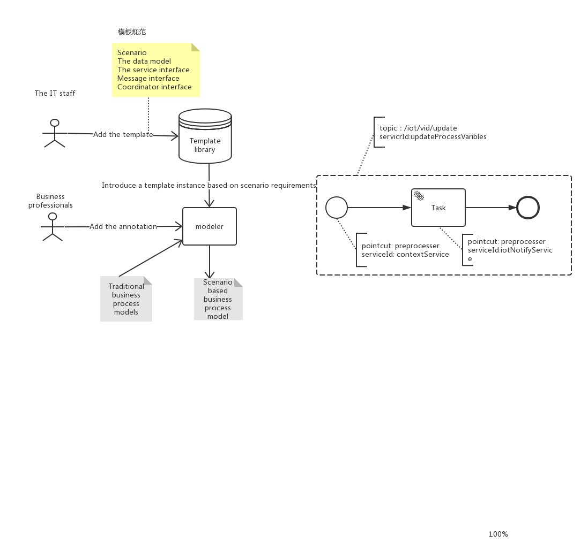

## Annotation On BPMN Model
> [vessel-process diagram with annotation](https://www.processon.com/diagraming/5b48555fe4b00b08ad1b0f6f)

## Groovy
- [Groovy-In-Action](https://www.dropbox.com/s/poku94joag3p8o4/Groovy-in-Action.pdf?dl=0)

## DMN
-  An detailed DMN example : [`DMN1.2 Specification p153-p174]`](https://www.dropbox.com/s/rnr15xh47de9et3/DMN-Specification-1.2.pdf?dl=0)
- [`Camunda DMN user guide`](https://docs.camunda.org/manual/latest/user-guide/dmn-engine/embed/)
-  [`Camunda engine DMN unittest`](https://github.com/camunda/camunda-engine-dmn-unittest) or [`another example using DMN standalone in Java-main`](https://github.com/camunda/camunda-bpm-examples/tree/master/dmn-engine/dmn-engine-java-main-method)
- [`Decision Require    ments Graph (DRG) example`](https://github.com/camunda/camunda-bpm-examples/tree/master/dmn-engine/dmn-engine-drg)


## References
- Camunda DMN Referemce : <https://docs.camunda.org/manual/7.9/reference/dmn11/>

## Activity Annotation
- This annotation is attached to the task, which is divided into pre annotation and post annotation.Pre annotation will be executed before the task starts.Post annotation will be executed after the task completed.
Annotations consist of these attributes:
- id,name : Specific properties of annotation
- implementationType : Classified as "globalType","localType","msgType".GlobalType means this annotation will have communicate with third party services.
For example,in cold-chain transport, a third party service is required to calculate the appropriate 
control temperature in combination with the current process information and return it.
The role of GlobalType annotation is to send the process information to the third party service and receive the return information from the third party
localType annotation provide local services. The msgType annotation will be triggered when the process receives certain information,such as delay message.
- pointcutType : It is divided into pre and post, which respectively represent pre execution and post execution
- destination : Fill in the name of the third party service.
- script : The logic you want third-party services to perform.
- inputVariables : It's a map which contains the process variables that need to be modified.
- outputVariables : It's a map which contains the process variables that have been modified.
- An example of the `Activity-Annotation` structure:
  ```xml
  <serviceTask id="serviceTask" implementation="defaultServiceTaskConnector"  name="cold-chain-ServiceTask">
        <extensionElements>
            <l2l:annotation id="anno_test1"  name="ForColdChain" implementationType="globalType" pointcutType="PreProcessor" destination="annotationConsumer" script="println 'Hello groovy script ...!'" 
            inputVariables= {(temperature: 10)} outputVariables= {(temperature:null)}/>
        </extensionElements>
    </serviceTask>
  ```
  This annotation will be executed before cold-chain-ServiceTask starts.It will send inputVariables to third party service which is determined by destination.
  The third party service will execute the logic in the annotation and sendback outputVariables.
## Message Annotation
- This annotation is attached to the process.This annotation will be executed at any time when the process is run.
Message annotation has more attributes than Activity annotation.The extensional attributes are as follows:
- topic : Important parameters for routing messages.
- scenario : The main scenario in which the process is located.At the same time it's important parameters for routing messages.
Message routing policy :point_right:https://github.com/l2l-v2/docs/blob/master/dev-docs/Implementation-of-Message-Routing.md
- An example of the `Message-Annotation` structure:
```xml
<process id="annotation_process_1" isClosed="false" isExecutable="true" processType="None">
     <extensionElements>
        <l2l:annotation id="msg_anno_test"  name="ForSsp" implementationType="msgType" pointcutType="" destination="VesselBusinessEntity" script="println 'Hello groovy script ...!'" topic="delay" scenario="ssp" inputVariables= {(destinations: null)} outputVariables= {(destinations:null)}/>
     </extensionElements>
     ...
</process>
```
While the process receive delay,the message annotation will be triggered.
It will request the service of VesselBusinessEntity and set the result of the service return into the process
# Iterative process development
## Introduction 


The traditional business process model is difficult to cope with the changeable scenario requirements, and can only meet the needs of the main scenario.
Business people add annotations through modelers to add new capabilities for traditional business process iteration.

