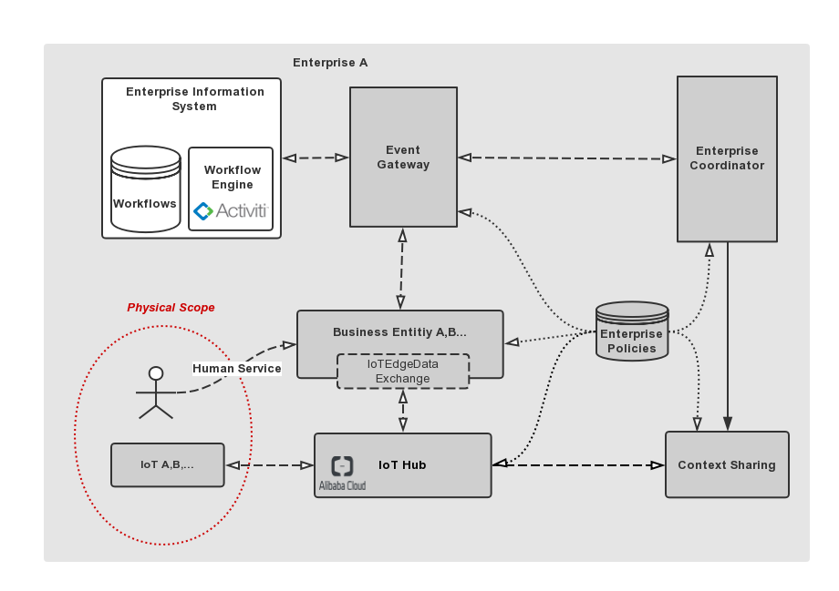

# Business Entities
- `Interaction between IoT and EIS`: :point_down:

## Design and Goal
We propose the `Business Entity` Module to solve the the business alignment between the EIS and IoT Infomation from physical environment. The responsibilities of `Business Entity` Module is as follows:
- `Business Entity` Module  collects  the  raw IoT data generated by many sensors through the `IoT Edage Data Exchange`.
- Based on the specific business situation,  `Business Entity` Module wraps the raw IoT data into business entities.
- `Business Entity` Module offers the `Human Service` to support the interaction between Human and  IoT.
-  `Business Entity` Module provides the EIS with the computing services on business eneties , also can  propagate IoT events of ` pysical scope` to EIS, and  then EIS determines how to deal with them.

## An Example in SSP scenario
- **Composition between the raw IoT data and business data correspoding to the specific scenario**

The `Vessel IoT` can generate raw data `<vid, logitude, latitude ,velocity, timestamp>` ,  and the `Vessel Business Entity`  also can acquire the business data, eg, the schedule of the vessel, the list of ports passing through, and the length of stay at each port. These data are relevant to the ssp scenario, but not generated from `Vessel IoT`. `Vessel Business Entity` combines the two party  data  from IoT and business situations into the business object and provides EIS or other modules with  the computing services on the business object. These services can have many capabilities , eg. when  the given vessel will arrive , and when the given vessel is expected to arrive or leave the given port.
- **Human Interaction  with IoT via Human Service**

when the user informs the given `Vessel IoT` of the `delay` message via `Human Service`. the `Business Entity` module will forward the event to EIS and let the EIS determine how to replan the schedule of the vessel, and call the computing services exposed by `Business Entity` module  to update  the business object.
